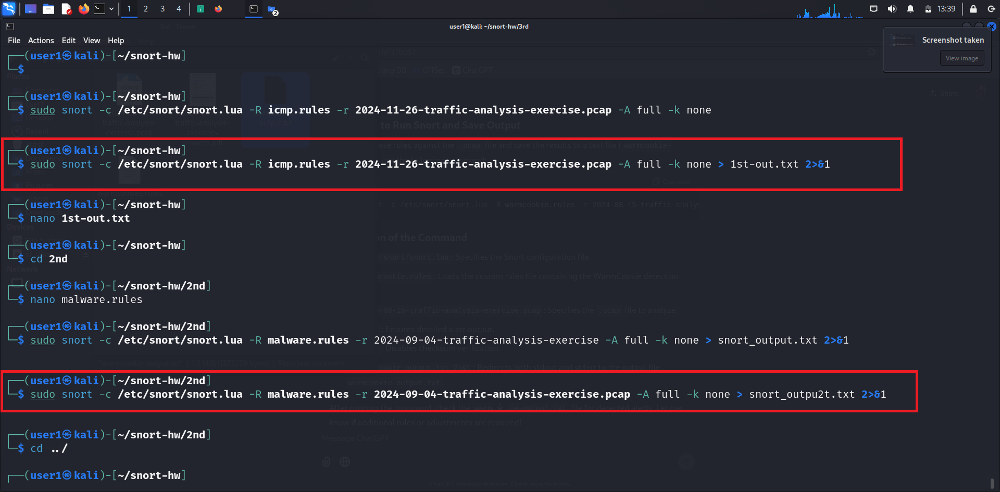
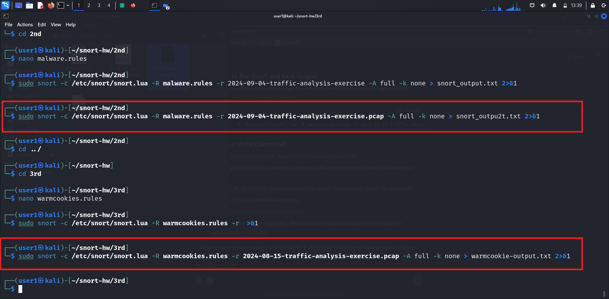

# Snort Rule Analysis Report

## Overview
This report consolidates the Snort rules and corresponding outputs for three different malware detection tasks. Each task contains:
- A description of the rules created.
- A hyperlink to download the rules in `.md` format.
- A hyperlink to the `.txt` output file of Snort when processing the respective rules.
- Screenshots of the results.

---

## Tasks

### Task 1: NetSupport RAT and SmartApeSG Detection
- **Description**:
  - Rules detect traffic associated with the NetSupport RAT C2 server, malicious domains (`modandcrackedapk.com`), and compromised host activity.
- **Files**:
  - [NetSupport RAT Rules](1task.md)
  - [NetSupport RAT Snort Output](1st-out.txt)

---

### Task 2: Koi Stealer Detection
- **Description**:
  - Rules detect Koi Stealer C2 communication, suspicious traffic to malicious domains, and compromised host activity.
- **Files**:
  - [Koi Stealer Rules](2task.md)
  - [Koi Stealer Snort Output](snort_outpu2t.txt)

---

### Task 3: WarmCookie Malware Detection
- **Description**:
  - Rules identify WarmCookie malware activities, including malicious ZIP and DLL downloads, suspicious traffic to malicious servers, and compromised host monitoring.
- **Files**:
  - [WarmCookie Rules](3task.md)
  - [WarmCookie Snort Output](warmcookie-output.txt)

---

## Screenshots

### Screenshot 1

### Screenshot 2

---

## Definition of Done

1. Snort rules created and validated for each task.
2. `.txt` output files generated after processing traffic with Snort for each task.
3. Clear Markdown documentation created for each task, including descriptions and hyperlinks.
4. Consolidated main `.md` file with hyperlinks to task-specific files and screenshots.

